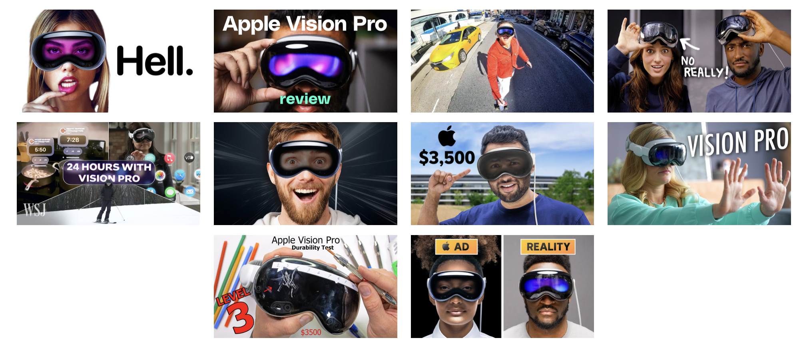

\newpage
# Abstract
\newpage

\tableofcontents
\newpage
# 1. Introduction
## 1.1 Youtube
YouTube, launched in 2005, has evolved from a simple video-sharing website to a comprehensive platform that shapes global digital culture. As the world's leading online video platform, YouTube facilitates an unparalleled exchange of ideas, interests, and information, transcending geographical and cultural boundaries. YouTube's impact on society and culture is profound. It has redefined entertainment, education, and marketing, offering a voice to those who might otherwise be marginalized in traditional media channels. The platform has become a critical space for social movements, political campaigning, and grassroots activism, showcasing its power to influence public opinion and spark societal change. For content creators and brands, YouTube comments serve as direct feedback from their audience. Analyzing comments can help identify what viewers appreciate, criticize, or wish to see more of in future content. Studying YouTube comments is crucial for gaining a deeper understanding of digital culture, audience engagement, and public discourse. It allows researchers and practitioners across various fields to tap into the wealth of qualitative data that YouTube uniquely provides. [5]  
This diversity is crucial for understanding the wide-ranging perceptions and acceptance of VR headsets across different demographics and cultures. Unlike other social platforms that may cater to niche audiences or specific demographics, YouTube's extensive reach ensures a comprehensive dataset that reflects a global perspective. YouTube hosts a vast array of content specifically focused on VR technology, including detailed reviews, comparisons, and educational content. This specificity allows us to gather data from a targeted audience genuinely interested in or curious about VR headsets. The comments in this context are likely to be more informed and nuanced, offering valuable insights into consumer expectations, experiences, and concerns.  

### 1.1.1 YoutubeAPI
For our project on analyzing trends in virtual reality content, we utilized the YouTube API, accessed through the "tuber" package in R, to systematically collect data. The YouTube API offers a comprehensive platform for extracting a wide range of data from YouTube, including video metrics, user comments, and content details, making it an invaluable resource for digital analysis. Our extraction process was conducted on February 8th 2024, ensuring that our data was current and reflective of recent discussions and viewpoints within the VR community. The "tuber" package in R provided a user-friendly interface for interacting with the YouTube API, allowing us to efficiently query the information needed without extensive manual effort. This approach enabled us to gather a rich dataset from popular technology channels on YouTube. Through this method, we aimed to understand better the public's interest and engagement with VR technologies, as well as identify emerging trends within the field. [10]  

## 1.2 Text Mining
Text mining is the process of extracting useful insights from text, a type of unstructured data. Essentially, it means going from an unorganized state to a summarized and structured state. During the analysis, we will see the ‘bag of words’ approach, in which every word or group of words, is treated as a unique feature of the reviews. In that way, we are not taking into account the order and the grammatical structure of the sentence, but we are using a very fast technique that is not computation- ally expensive. Text analytics software has impacted the way that many industries work, allowing them to improve product user experiences as well as make faster and better business decisions. In the IBM site we can find a list of examples:  
• Customer service: Text mining and sentiment analysis can provide a mechanism for companies to prioritize key pain points for their customers, allowing businesses to respond to urgent issues in real-time and increase customer satisfaction.  
• Risk management: It provide insights around industry trends and financial markets by monitoring shifts in sentiment.  
• Maintenance: It automates decision making by revealing patterns that correlate with problems and preventive and reactive maintenance procedures.  
• Healthcare: Manual investigation of medical research can be costly and time-consuming; text mining provides an automation method for extracting valuable information from medical literature.   
• Spam filtering: Text mining can provide a method to filter and exclude these e-mails from inboxes, improving the overall user experience and minimizing the risk of cyber-attacks to end users. [1]  
In the interdisciplinary field of computational social sciences, text mining has emerged as a pivotal methodology for extracting meaningful information from unstructured textual data. This technique leverages computational algorithms to analyze, understand, and interpret large volumes of text, enabling researchers to glean insights into human behavior, societal trends, and cultural norms. By converting vast amounts of textual data into actionable knowledge, researchers can contribute to a better understanding of our world. However, the successful application of text mining requires not only technical expertise but also a thoughtful consideration of the ethical implications of analyzing human-generated text data. [4]

## 1.3 Virtual Reality
Virtual reality (VR) is a simulated experience that employs pose tracking and 3D near-eye displays to give the user an immersive feel of a virtual world. Applications of virtual reality include entertainment (particularly video games), education (such as medical or military training) and business (such as virtual meetings). Other distinct types of VR-style technology include augmented reality and mixed reality. A person using virtual reality equipment is able to look around the artificial world, move around in it, and interact with virtual features or items. In social sciences and psychology, virtual reality offers a cost-effective tool to study and replicate interactions in a controlled environment. It can be used as a form of therapeutic intervention. For instance, there is the case of the virtual reality exposure therapy (VRET), a form of exposure therapy for treating anxiety disorders such as post traumatic stress disorder (PTSD) and phobias.  
Some users may experience twitches, seizures or blackouts while using VR headsets, even if they do not have a history of epilepsy and have never had blackouts or seizures before. Motion sickness, eyestrain, headaches, and discomfort are the most prevalent short-term adverse effects. [6]  

### 1.3.1 Virtual Reality Hardware
The evolution of VR hardware has been marked by significant technological advancements aimed at improving the quality of immersion and reducing physical discomfort. Early VR systems were bulky, expensive, and limited in capability, accessible primarily to research institutions and large corporations. Over the years, advancements in display technology, miniaturization, and sensor accuracy have led to the development of more affordable, consumer-friendly VR systems more accessible for the general public. Today's VR hardware is witnessing trends toward wireless technology, increased portability, and integration with cloud computing and AI to deliver more realistic and complex virtual experiences. Despite these advancements, challenges remain, such as the previously cited motion sickenss.  
The market for VR technology has been growing along with the technology’s rapid development.The global virtual reality market size was valued at US`$` 19.44 billion in 2022 and is projected to grow from US`$` 25.11 billion in 2023 to US`$` 165.91 billion by 2030. [8]  
The history of virtual reality (VR) is a tale of continuous innovation, from the early sensory immersion of Morton Heilig's Sensorama and Ivan Sutherland's pioneering head-mounted display in the 1960s, through the gaming-centric 1990s with Virtuality Group's arcades and Nintendo's Virtual Boy. The sector saw a major revival with the Oculus Rift in 2012, indicating VR's consumer potential, further propelled by the HTC Vive and PlayStation VR in 2016, enhancing immersive gaming and beyond. Today, with the release of Apple Vision Pro, the release generated significant excitement, with the internet flooded with videos and testimonials showcasing the device in various settings. While some viewed it as a potential driver for VR's widespread adoption, others expressed reservations about its accessibility and the breadth of its content ecosystem. Considering the significant attention this product has gained, we will examine comments directed at a selection of the most prominent English-speaking technology influencers, commonly known as 'YouTubers'. [9]  

## 1.4 Concers about VR   
Children are becoming increasingly aware of VR, with the number in the USA having never heard of it dropping by half from Autumn 2016 (40%) to Spring 2017 (19%). [7]  
Currently, there is a lack of information on the short- and long-term physiological impacts of VR. There is also not enough known about who and what types of individuals are using VR (age, types of experience, attitudes, and levels of digital sophistication). Many questions relate to individual attributes, and to what degree the user needs to possess “critical reasoning” abilities. The intersection of ethics and virtual reality has to date focused primarily on individual issues, for example, specific content, or blood or violence. While these dilemmas are important, many other subtler ethical issues relating to virtual reality demand the attention of designers, scientists, engineers, and related communities. Designers, programmers, and testers usually focus on specific areas, yet they could be involved in contributing to solutions to ethical issues, or they could be responsible for inputting ethical concerns. Frequently, designers must make decisions based on the lens of their knowledge and experiences. But designers’ scope of knowledge does not always encompass the wide range of areas that might impact the public related to physiological, social, or ethical aspects. The public and users have a predisposition to trust technologies from big brands, often involving acceptance without questioning. While VR solutions possess the power to entertain, engage, and tantalize users, they also have the power to cause significant physiological trauma. There are worrying concerns about over-trusting new technologies. Studies have shown children are most vulnerable when it comes to VR technologies, as they are highly susceptible and can more easily confuse what is real and what is not real, i.e., they likely may be less able or unable to distinguish between the real world and the virtual world. For example, in a study by Segovia and Bailenson, young elementary children watched their virtual doppelganger swimming with orcas. When these kids were questioned a week later, they said they believed their virtual experience to be real [3]. In recent studies, young children would connect with “virtual characters” (avatars). Children would see the “avatar” in VR as more real (compared to characters or avatars on other mediums, such as television). The avatar in the virtual environment would be more influential compared to the television equivalent, making it more difficult for the children to inhibit their actions or not follow the avatar’s commands. And it is not only young children who internalize VR scenarios – these scenarios also impact young adults. For example, elder adolescents have been found to be particularly sensitive to being socially excluded in a virtual environment.There are “dangers” with anything – however, we must not forget the huge benefits of combining VR with games, in education, rehabilitation, training, and of course, entertainment. VR is a technology – how we use VR, for good or bad, is up to us. [2]
Our research, which draws upon the analysis of YouTube comments on VR-related videos, unveils a public discourse rich with insights into the apprehensions surrounding VR.   

# 2. Methodology  

## 2.1 The dataset
The dataset is composed of comments from a selection of YouTube videos, chosen based on their popularity while also considering diversity. This compilation resulted in approximately 100,000 comments across 10 distinct videos, which collectively have gained over 60 million views.  

  


## 2.2 Cleaning the dataset
```{r, echo=FALSE}

comments = read.csv("comments1March.csv", sep = ',')
comments = comments[,-1]
```

### 2.2.1 Dealing with emojis 
### 2.2.2 Corpus  

After preparing our data, we proceed to structure it into a corpus. A corpus is an organized collection of text that transforms unstructured text into a structured format, essentially a compilation of documents (in our case, social media comments). The next step involves cleaning the text, which includes converting all letters to lowercase, eliminating numbers, removing 'stopwords', excising white spaces, and stripping punctuation. 'Stopwords' refer to frequently occurring words that offer no significant insight for analysis. These are common words, such as 'the', 'is', and 'at', which appear frequently across texts. Their removal is pivotal for focusing on more significant elements of the text. This cleaning process is essential for standardizing the text and minimizing noise, enhancing the clarity and relevance of the data for subsequent analysis.  

### 2.2.3 TDM - term document matrix  
The term document matrix is the analytical representation of a corpus. In TDM each column represents an individual review, while each row the words. There exist also the DTM (document term matrix), which is its transpose. The appearance of a word in a review can be coded in many ways, thus this matrix can be weighted in different manners. We will use TF - term frequencies which simply count the number of occurrences by word.
In our bag of words approach, the matrix is what the analytics are based on.
Our matrix has 47779 rows and 103773 columns. Meaning that after cleaning, 47779 different words have remained in 103773 comments.  


## 2.3 Sentiment analysis
Sentiment analysis is the process of extracting an author’s emotional intent from text. There are several emotional frameworks that can be used for sentiment analysis. We will focus on polarity, in which there are only two categories, positive and negative.
Subjectivity lexicon assigns to a particular word an emotional state, there exists a few; we are going to see two of them:
• Bing: categorizes words in a binary fashion into positive and negative categories. It was developed by Liu Bing, a researcher from the University of Illinois. It contains approximately 6800 words.
• NRC: list words and their associations with eight basic emotions (anger, fear, anticipation, trust, surprise, sadness, joy, and disgust) and two sentiments (negative and positive). It was developed by Robert Plutchik, a psychologist. He believed that the eight primary emotions helped to improve survivability over time and were passed on from generation to generation. Any emotional states outside of these are amalgamations of the original eight and are therefore subordinate. It contains approximately 13900 words, of which, around 5600 are related to polarity. [11]

### 2.3.1 Bing Lexicon
We have to use tokenized words. Tokenization is feature extraction, the process of breaking up sequences of strings into pieces such as words in our case (for the moment).
We apply sentiment polarity to tokenized words, by doing so we are able to plot the most frequent words by sentiment:

### 2.3.1 NRC Lexicon
We try also the NRC lexicon for comparison and to see if the results are consistent with respect to Bing.

## 2.4 Word Association
The next step is to explore which words are most associated with those ones. Word association, as seen in the Kwartler’s book, is a sort of statistical correlation. It is an implication of the form X → Y, where X is a set of antecedent words and Y is the consequent word. It ranges from 0 to 1 instead of -1 to 1. Since all words would have some associative word, looking at outliers may not be appropriate, and thus the frequency analysis is usually performed first as we have done. [11]  

## 2.5 Bi-Grams
Until now we have considered tokens of uni-grams, which means just 1 word at a time. By examing how frequently one word is followed by another, we can build an idea on the most common topics. Another important aspect, is when a word is preceded by a negation like ‘not’, ‘never’, ‘without’... and son on; that can change radically the sentiment on the comment with respect to sentiment analysis on uni-grams like before. I decided to not consider emojis because the most frequent bi-grams would have been, in that case, ‘smiling-face’, ‘red-heart’, and so on. Their inclusion would have led to a lot of noise in the following graphs. We start by having a look at the top 10 bi-grams by frequency:   

### 2.5.1 Negation words in Bi-Grams
Without context, some sentiments could be misinterpreted. The next plot shows which words are misclassified, we will have an idea of the magnitude of the error thanks to the AFINN lexicon, which assign a numerical score (larger than 0 for positive, vice-versa for negative) instead of being just dichotomous. The x-axis is a multiplication between the sentiment score of the AFINN and the number of occurrences:
 
 
## 2.6 Correlation
We are interested in words that co-occur within particular reviews or among them, even if not next to each other. We consider groups of 14 comments each, and we are going to see which words are pairwise correlated using a function inside the widyr package. We still use the data without emoji for the same reason of bi-grams. For the moment we focus on negative words that have come out from the sentiment analysis, to see whether we can find correlated topics: [12]

## 2.7 Term Frequency Inverse Document Frequency - TFIDF
To create a comparison cloud we need two subsets of the original data: positive and negative reviews. The drawback of this approach is the elimination of all the neutral reviews with a score of 0. We will create one corpus containing two elements, one for each collapsed vector of characters containing either one of the polarities. From the corpus, we will obtain a TDM changing the term weights. The weighting has been changed to ‘Term Frequency Inverse Document Frequency’ (TFIDF).
Instead of simple term frequency, the TFIDF value increases with the term occurrence but is offset by the overall frequency of the word in the corpus. The offsetting effect helps remove commonly occurring terms that may not yield much information. From a common sense perspective, if a term appears often, it must be important and represented in frequency. However, if it appears in all reviews, it is likely not that insightful or informational.
It is calculated as the product of ‘Term Frequency’ (TF) and ‘Inverse Document Frequency’ (IDF), the latter is equal to log(total document in corpus / # with term t in it).  
• Now we can build the comparison cloud based on scaled polarity score and weighted TFIDF:  

## 2.8 Topic Modelling
## 2.9 Exploring differences by community
# 3. Conclusions
# 4. Discussion
\newpage
# Bibliography
[1]  https://www.ibm.com/cloud/learn/text-mining  
[2] https://technologyandsociety.org/virtual-reality-ethical-challenges-and-dangers    
[3] Virtually True: Children’s Acquisition of False Memories in Virtual Reality, Y. Segovia and J. Bailenson, 2009  
[4] Text mining for social science – The state and the future of
computational text analysis in sociology, A. Macanovic, 2022   
[5] https://en.wikipedia.org/wiki/YouTube  
[6] https://en.wikipedia.org/wiki/Virtual_reality  
[7] Children and Virtual Reality: Emerging Possibilities and Challenges, D. Douthwhite, 2017  
[8] Virtual Reality Market Size Analysis, Fortune Business Insights, 2023  
[9] https://virtualspeech.com/blog/history-of-vr  
[10] https://cran.r-project.org/web/packages/tuber/index.html  
[11] Text Mining in Practice with R, Ted Kwartler, WILEY  
[12] https://cran.r-project.org/web/packages/widyr/index.html  
