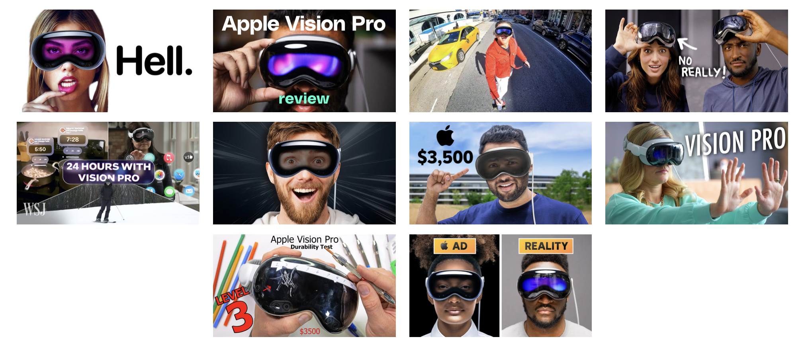
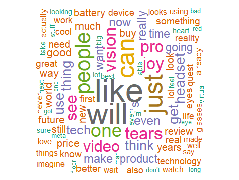
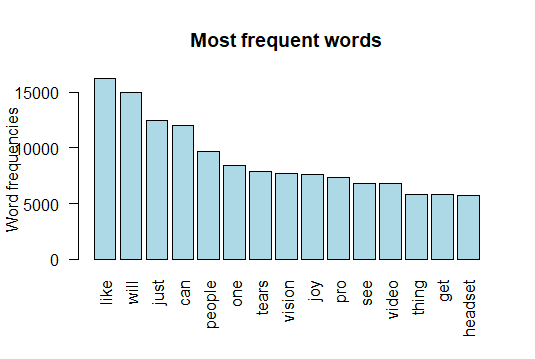
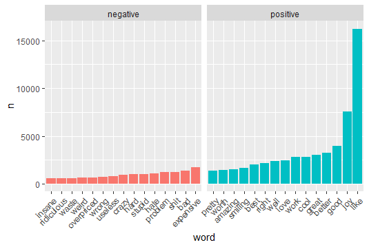
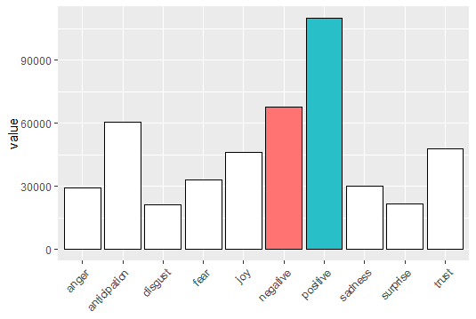
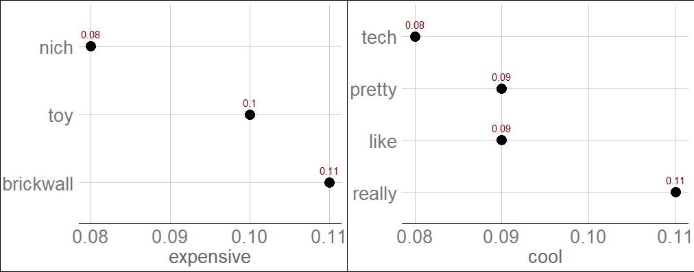

\newpage
# Abstract  
Based on the comprehensive analysis of YouTube comments on Virtual Reality content, the study explores the societal implications of this technology. A predominantly positive sentiment towards VR, highlighting enthusiasm for its advancement despite acknowledging its negative side effects. The research utilized text mining, sentiment analysis, word association, bi-grams, correlation, and topic modeling to explore public perceptions. It uncovered concerns about VR's social implications, including potential isolation and ethical considerations. The findings indicate a complex public discourse, balancing excitement for VR's possibilities against caution over its societal impact. This view suggests a careful consideration of VR's role in future technological and social landscapes. 

\newpage

\tableofcontents
\newpage
# 1. Introduction
## 1.1 Youtube
YouTube, launched in 2005, has evolved from a simple video-sharing website to a comprehensive platform that shapes global digital culture. As the world's leading online video platform, YouTube facilitates an unparalleled exchange of ideas, interests, and information, transcending geographical and cultural boundaries. YouTube's impact on society and culture is profound. It has redefined entertainment, education, and marketing, offering a voice to those who might otherwise be marginalized in traditional media channels. The platform has become a critical space for social movements, political campaigning, and grassroots activism, showcasing its power to influence public opinion and spark societal change. For content creators and brands, YouTube comments serve as direct feedback from their audience. Analyzing comments can help identify what viewers appreciate, criticize, or wish to see more of in future content. Studying YouTube comments is crucial for gaining a deeper understanding of digital culture, audience engagement, and public discourse. It allows researchers across various fields to tap into the wealth of qualitative data that YouTube provides. [5]  
This diversity is crucial for understanding the wide-ranging perceptions and acceptance of VR headsets across different demographics and cultures. Unlike other social platforms that may cater to niche audiences or specific demographics, YouTube's extensive reach ensures a comprehensive dataset that reflects a global perspective. YouTube hosts a vast array of content specifically focused on VR technology, including detailed reviews, comparisons, and educational content. This specificity allows us to gather data from a targeted audience genuinely interested in or curious about VR headsets. The comments in this context are likely to be more informed, offering valuable insights into consumer expectations, experiences, and concerns.  

### 1.1.1 YoutubeAPI
For our project on analyzing trends in virtual reality content, we utilized the YouTube API, accessed through the "tuber" package in R, to systematically collect data. The YouTube API offers a comprehensive platform for extracting a wide range of data from YouTube, including video metrics, user comments, and content details, making it an  resource for digital analysis. Our extraction process was conducted on March 1st 2024, ensuring that our data was current and reflective of recent discussions and viewpoints within the VR community. The "tuber" package in R provides a user-friendly interface for interacting with the YouTube API, allowing us to efficiently query the information needed. This approach enabled us to gather a rich dataset from popular technology channels on YouTube. Through this method, we aimed to understand better the public's interest and engagement with VR technologies, as well as identify emerging trends within the field. [10]  

## 1.2 Text Mining
Text mining is the process of extracting useful insights from text, a type of unstructured data. Essentially, it means going from an unorganized state to a summarized and structured state. During the analysis, we will see the ‘bag of words’ approach, in which every word or group of words, is treated as a unique feature of the comments. In that way, we are not taking into account the order and the grammatical structure of the sentence, but we are using a very fast technique that is not computationally expensive. Text analytics software has impacted the way that many industries work, allowing them to improve product user experiences as well as make faster and better business decisions. In the IBM site we can find a list of examples:  
• Customer service: Text mining and sentiment analysis can provide a mechanism for companies to prioritize key pain points for their customers, allowing businesses to respond to urgent issues in real-time and increase customer satisfaction.  
• Risk management: It provide insights around industry trends and financial markets by monitoring shifts in sentiment.  
• Maintenance: It automates decision making by revealing patterns that correlate with problems and preventive and reactive maintenance procedures.  
• Healthcare: Manual investigation of medical research can be costly and time-consuming; text mining provides an automation method for extracting valuable information from medical literature.   
• Spam filtering: Text mining can provide a method to filter and exclude these e-mails from inboxes, improving the overall user experience and minimizing the risk of cyber-attacks to end users. [1]  
In the interdisciplinary field of computational social sciences, text mining has emerged as a pivotal methodology for extracting meaningful information from unstructured textual data. This technique utilizes computational algorithms to analyze, understand, and interpret large volumes of text, enabling researchers to glean insights into human behavior, societal trends, and cultural norms. By converting vast amounts of textual data into actionable knowledge, researchers can contribute to a better understanding of our world. However, the successful application of text mining requires not only technical expertise but also a thoughtful consideration of the ethical implications of analyzing human-generated text data. [4]

## 1.3 Virtual Reality
Virtual reality (VR) is a simulated experience that employs pose tracking and 3D near-eye displays to give the user an immersive feel of a virtual world. Applications of virtual reality include entertainment (particularly video games), education (such as medical or military training) and business (such as virtual meetings). Other distinct types of VR-style technology include augmented reality and mixed reality. A person using virtual reality equipment is able to look around the artificial world, move around in it, and interact with virtual features or items. In social sciences and psychology, virtual reality offers a cost-effective tool to study and replicate interactions in a controlled environment. It can be used as a form of therapeutic intervention. For instance, there is the case of the virtual reality exposure therapy (VRET), a form of exposure therapy for treating anxiety disorders such as post traumatic stress disorder (PTSD) and phobias.  
Some users may experience twitches, seizures or blackouts while using VR headsets, even if they do not have a history of epilepsy and have never had blackouts or seizures before. Motion sickness, eyestrain, headaches, and discomfort are the most prevalent short-term adverse effects. [6]  

### 1.3.1 Virtual Reality Hardware
The evolution of VR hardware has been marked by significant technological advancements aimed at improving the quality of immersion and reducing physical discomfort. Early VR systems were bulky, expensive, and limited in capability, accessible primarily to research institutions and large corporations. Over the years, advancements in display technology, miniaturization, and sensor accuracy have led to the development of more affordable, consumer-friendly VR systems more accessible for the general public. Today's VR hardware is witnessing trends toward wireless technology, increased portability, and integration with cloud computing and AI to deliver more realistic and complex virtual experiences. Despite these advancements, challenges remain, such as the previously cited motion sickness.  
The market for VR technology has been growing along with the technology's rapid development.The global virtual reality market size was valued at US`$` 19.44 billion in 2022 and is projected to grow from US`$` 25.11 billion in 2023 to US`$` 165.91 billion by 2030. [8]  
The history of virtual reality (VR) is a tale of continuous innovation, from the early sensory immersion of Morton Heilig's Sensorama and Ivan Sutherland's pioneering head-mounted display in the 1960s, through the gaming-centric 1990s with Virtuality Group's arcades and Nintendo's Virtual Boy. The sector saw a major revival with the Oculus Rift in 2012, indicating VR's consumer potential, further propelled by the HTC Vive and PlayStation VR in 2016, enhancing immersive gaming and beyond. Today, with the release of Apple Vision Pro the internet flooded with videos and testimonials showcasing the device in various settings. While some viewed it as a potential driver for VR's widespread adoption, others expressed reservations about its accessibility. Considering the significant attention this product has gained, we will examine comments directed at a selection of the most prominent English-speaking technology influencers, commonly known as 'YouTubers'. [9]  

## 1.4 Concers about VR   
Children are becoming increasingly aware of VR, with the number in the USA having never heard of it dropping by half from Autumn 2016 (40%) to Spring 2017 (19%). [7]  
Currently, there is a lack of information on the short- and long-term physiological impacts of VR. There is also not enough known about who and what types of individuals are using VR (age, types of experience, attitudes, and levels of digital sophistication). Many questions relate to individual attributes, and to what degree the user needs to possess “critical reasoning” abilities. The intersection of ethics and virtual reality has to date focused primarily on individual issues, for example, specific content, or blood or violence. While these dilemmas are important, many other subtler ethical issues relating to virtual reality demand the attention of designers, scientists, engineers, and related communities. Designers, programmers, and testers usually focus on specific areas, yet they could be involved in contributing to solutions to ethical issues, or they could be responsible for inputting ethical concerns. Frequently, designers must make decisions based on the lens of their knowledge and experiences. But designers’ scope of knowledge does not always encompass the wide range of areas that might impact the public related to physiological, social, or ethical aspects. The public and users have a predisposition to trust technologies from big brands, often involving acceptance without questioning. While VR solutions possess the power to entertain, engage, and tantalize users, they also have the power to cause significant physiological trauma. There are worrying concerns about over-trusting new technologies. Studies have shown children are most vulnerable when it comes to VR technologies, as they are highly susceptible and can more easily confuse what is real and what is not real. They likely may be less able or unable to distinguish between the real world and the virtual world. For example, in a study by Segovia and Bailenson, young elementary children watched their virtual doppelganger swimming with orcas. When these kids were questioned a week later, they said they believed their virtual experience to be real [3]. In recent studies, young children would connect with “virtual characters” (avatars). Children would see the “avatar” in VR as more real (compared to characters or avatars on other mediums, such as television). The avatar in the virtual environment would be more influential compared to the television equivalent, making it more difficult for the children to inhibit their actions or not follow the avatar’s commands. And it is not only young children who internalize VR scenarios – these scenarios also impact young adults. For example, elder adolescents have been found to be particularly sensitive to being socially excluded in a virtual environment.There are “dangers” with anything – however, we must not forget the huge benefits of combining VR with games, in education, rehabilitation, training, and of course, entertainment. VR is a technology – how we use VR, for good or bad, is up to us. [2]
Our research, which draws upon the analysis of YouTube comments on VR-related videos, unveils a public discourse rich with insights into the apprehensions surrounding VR.   

# 2. Methodology  

## 2.1 The dataset
The dataset is composed of comments from a selection of YouTube videos, chosen based on their popularity while also considering diversity. This compilation resulted in approximately 100,000 comments across 10 distinct videos, which collectively have gained over 60 million views.  

  

## 2.2 Cleaning the dataset

### 2.2.1 Dealing with emojis 
To address the challenge of interpreting emojis in text mining, I developed a script, now available on the GitHub repo of this project [15], designed to translate emojis into text. The script ensures that the lastest releases of emojis have been includes in the translation. Something that current solution are not able to do. This is crucial when working with social media text data, so that the whole spectrum of sentiment coming from emoticons is kept into account. To this point, I specify that the translated version of emojis is used for tools like sentiment analysis. While they are erased for any other method to ensure integrity of the data.  

### 2.2.2 Corpus  

After preparing our data, we proceed to structure it into a corpus. A corpus is an organized collection of text that transforms unstructured text into a structured format, essentially a compilation of documents (in our case, social media comments). The next step involves cleaning the text, which includes converting all letters to lowercase, eliminating numbers, removing 'stopwords', excising white spaces, and stripping punctuation. 'Stopwords' refer to frequently occurring words that offer no significant insight for analysis. These are common words, such as 'the', 'is', and 'at', which appear frequently across texts. Their removal is pivotal for focusing on more significant elements of the text. This cleaning process is essential for standardizing the text and minimizing noise, enhancing the clarity and relevance of the data for subsequent analysis.  

### 2.2.3 TDM - term document matrix  
The term document matrix is the analytical representation of a corpus. In TDM each column represents an individual review, while each row the words. There exist also the DTM (document term matrix), which is its transpose. The appearance of a word in a review can be coded in many ways, thus this matrix can be weighted in different manners. We will use TF - term frequencies which simply count the number of occurrences by word.
In our bag of words approach, the matrix is what the analytics are based on.
Our matrix has 47779 rows and 103773 columns. Meaning that after cleaning, 47779 different words have remained in 103773 comments.  

### 2.2.4 Word frequencies  
Wordcloud is a popular and powerful tool for showing term frequencies. 

 

  
• The result sometimes could be crowded, so instead we can visualize the frequencies in a barplot:
  

We can spot among the most frequent words suggestions of positive sentiment. Which will be explored in the next section.   

## 2.3 Sentiment analysis
Sentiment analysis is the process of extracting an author’s emotional intent from text. There are several emotional frameworks that can be used for sentiment analysis. We will focus on polarity, in which there are only two categories, positive and negative.
Subjectivity lexicon assigns to a particular word an emotional state, there exists a few; we are going to see two of them:
• Bing: categorizes words in a binary fashion into positive and negative categories. It was developed by Liu Bing, a researcher from the University of Illinois. It contains approximately 6800 words.
• NRC: list words and their associations with eight basic emotions (anger, fear, anticipation, trust, surprise, sadness, joy, and disgust) and two sentiments (negative and positive). It was developed by Robert Plutchik, a psychologist. He believed that the eight primary emotions helped to improve survivability over time and were passed on from generation to generation. Any emotional states outside of these are amalgamations of the original eight and are therefore subordinate. It contains approximately 13900 words, of which, around 5600 are related to polarity. [11]

### 2.3.1 Bing Lexicon
We have to use tokenized words. Tokenization is feature extraction, the process of breaking up sequences of strings into pieces such as words in our case.
We apply sentiment polarity to tokenized words, by doing so we are able to plot the most frequent words by sentiment:  
  

### 2.3.2 NRC Lexicon
We try also the NRC lexicon for comparison and to see if the results are consistent with respect to Bing.  
  

• Those dictionaries highlighted words crucial to sentiment. These terms will serve as the foundation for subsequent analyses. We aim to explore what those words refer to, aiming at further enrich the debate about Virtual Reality pros and cons. The NRC package unlocks the possibility to explore the distribution of a spectrum of emotions:  
  

• The polarity is skewed toward positive. Among emotions the most prevalent is 'anticipation'. Which is 'a feeling of excitement about something that is going to happen in the near future'. [13]   

## 2.4 Word Association
The next step is to explore which words are most associated with those ones. Word association, as seen in the Kwartler’s book, is a sort of statistical correlation. It is an implication of the form X → Y, where X is a set of antecedent words and Y is the consequent word. It ranges from 0 to 1 instead of -1 to 1. Since all words would have some associative word, looking at outliers may not be appropriate, and thus the frequency analysis is usually performed first as we have done. [11]  

  

• We started to explore possibles topic of discussion from big polarity players. This approach was applied to all words, though it did not always yield valuable insights. This is because word association is not directly related to frequency but instead refers to the term pairings.  

## 2.5 Bi-Grams
Until now we have considered tokens of uni-grams, which means just 1 word at a time. By examining how frequently one word is followed by another, we can build an idea on the most common topics. For instance, by analyzing the frequency and occurrence of bi-grams in large text corpora, predictive text systems can suggest the most likely next word based on the current word input, this is commonly used in keyboard software on smartphones. I decided to not consider emojis because the most frequent bi-grams would have been in that case, ‘smiling-face’, ‘red-heart’, and so on. Their inclusion would have led to a lot of noise in the following graphs. We start by having a look at the top 10 bi-grams by frequency:  

\begin{center}
\includegraphics[width=0.5\linewidth]{plots/bigrams.png}
\end{center}
  
We can arrange words into a network connected by nodes using the package ‘igraph’. Most common words will create center nodes. The shade of darkness of the arrow will depend on the frequency of that bi-gram. We now visualize only bi-grams with a frequency larger than 200 times: [14]

\begin{center}
\includegraphics[width=1\linewidth]{plots/Rplot12.png}
\end{center}

### 2.5.1 Bi-Grams and sentiment  
This tool can be integrated with sentiment analysis to focus on sentiments associated with controversial topics in this field, such as "children" and "society". Additionally, it aims to uncover unique aspects related to the product, specifically concerning "buy" and "headset", as well as distinctive features of the technology, including "immersion" and "reality".  
\begin{center}
\includegraphics[width=1\linewidth]{plots/Rplot15.png}
\end{center}
 

• The product itself generally receives positive sentiment, whereas the sentiment surrounding social aspects can be quite divided.  

## 2.6 Correlation
We are interested in words that co-occur within particular comment or among them, even if not next to each other. We are going to see which words are pairwise correlated using a function inside the 'widyr' package. We still use the data without emojis for the same reason of bi-grams. We focus on words that have come out from the sentiment analysis, to see whether we can find correlated topics: [12]  

\begin{center}
\includegraphics[width=1\linewidth]{plots/correlations.png}
\end{center}

• Similarly to n-grams we can build a network of words:

\begin{center}
\includegraphics[width=1\linewidth]{plots/Rplot17.png}
\end{center}

In this case, since the correlation is a symmetric kind of association we don’t have arrows in our graph.

## 2.8 Topic Modelling  
Topic modeling is a statistical method for uncovering the underlying thematic structure in a large corpus of text. By analyzing patterns of word occurrences across documents, it identifies topics—clusters of related words—that represent the main subjects discussed in the corpus. The most common approach to topic modeling is Latent Dirichlet Allocation (LDA), where the algorithm assigns each document a mixture of topics and each topic a distribution of words, based on the assumption that documents are produced from a mixture of these topics. We apply this technique to our data. In the following plots the red indicates the term frequency in the topic while the light blue bar indicates the overall frequency of the term:  

\begin{center}
\includegraphics[width=1\linewidth]{plotsTopic/image-8.png}
\end{center}
• The first topic appears to be centered around people's attitudes and thoughts towards technology, with a focus on the desire for technological advancement and the problems that need to be addressed. The high frequency of words like "people", "think", "technology", "things", "already", "even", "time", "many" and "want" suggests a discussion about the current state of technology and people's expectations of it. There's also an indication of a desire for progress with words like "way", "make", "tech" and "need." The presence of words like "problem", "lot", "used", "long", "enough" and "social" could imply concerns about technological impacts on society or issues that are perceived as long-standing and perhaps not adequately addressed yet.  
• The second one is more speculative and possibly philosophical, focusing on the potential future impacts of virtual reality on society and individuals. Words like "will", "world", "real", "life", "reality", "day", "live", "change", "society," "everyone", "one", "human" and "every" imply broad and deep impacts on daily life and society as a whole.  
\begin{center}
\includegraphics[width=1\linewidth]{plotsTopic/image-8 copy.png}
\end{center}
• Topic 3: The dominant words in this topic are very specific to virtual reality hardware and its ecosystem. Words like "vision", "pro", "headset", "quest", "use", "work", "games", "mac", and "meta" suggest a discussion about the Apple Vision Pro's compatibility with various devices (like Mac computers) and possibly a comparison with other VR headsets (like the Meta Quest). The presence of "app", "apps", "play", "gaming", "game", and "virtual" indicates a focus on the applications and gaming potential of the headset. Lastly, "experience," "display," "device," "computer," "space," "windows," "screen", "tracking", "computing", and "hand" highlight technical specifications and features.    
• Topic 4: This topic seems to be concerned with the practicalities of using the device. Words like "battery", "use", "phone", "headset", "device", "need", "can", "make", "way", "get", "head", "much", "put" and "hours" suggest discussions about the battery life of the headset, how it is used with phones, and how comfortable it is to wear for extended periods ("head" and "hours").    

\begin{center}
\includegraphics[width=1\linewidth]{plotsTopic/image-12.png}
\end{center}

• Topic 5: This topic seems to revolve around consumer opinions regarding Apple's products and pricing strategy. The frequent mention of "apple" , "product", "price", "better", "made", "make", "new", "products" and "still" suggests a focus on the quality, innovation, and release of new products from Apple. "Much", "expensive", "hate", "market", "cost", "hard" and "company" indicate discussions about the high price point of Apple products and possibly a negative sentiment towards the cost or the difficulty of affording these products. The word "cheaper" could be in reference to a desire for more affordable options.  

• Topic 6: This topic appears to be more focused on the experience and visual aspects of using Apple's virtual reality products. The words "can", "see", "imagine", "one", "eyes", "around", "face", "wearing" and "someone" all relate to the visual and immersive experience of VR.  

\begin{center}
\includegraphics[width=1\linewidth]{plotsTopic/image-12 copy.png}
\end{center}

• Topic 7: This topic seems to be centered on expectations and anticipation for the future of Apple's technology. Words like "will", "now", "years", "future", "first", "going", "wait", "time", "tech", "get", "next", "right", "one", "back" and "don't" suggest a dialogue about what is currently available and what may come next. The presence of "iPhone" and "version" could indicate comparisons or expectations of integration with other Apple products or updates. "Come", "can't", "sure", "hope", "start", "everyone" and "see" imply eagerness and hope for future developments. "Definitely" and "year" could point to specific expectations or predictions for when new versions or technology will be released.  

• Topic 8: This topic appears to reflect opinions on the design and aesthetic appeal of the VR product. Words like "like", "really", "just", "look", "good", "something", "cool", "looks", "glasses", "feel", "thing" and "seems" suggest comments on how the VR glasses look and feel to the users. The word "wear" indicates discussions about the comfort or fashion of wearing the device. "See", "stuff", "pretty", "think", and "goggles" further support the idea that the comments are about the physical attributes of the product.  

\begin{center}
\includegraphics[width=1\linewidth]{plotsTopic/image-13.png}
\end{center}  
• Topic 9: This topic seems to be focused on the purchasing decision and value assessment of the product. The repetition of "just", "buy", "thing", "one", "want", "know", "get", and "money" implies that commenters are discussing whether or not to purchase the product and are evaluating its value for money. The words "say", "gonna", "even", "never", "people" and "lol" suggest a mixture of seriousness and humor in the discussions, with some people expressing definitive stances on the product ("never"). "Literally", "anything", "stupid", "another", "anyone", "yeah", "afford", "can't", "everything" and "plastic" appear to further articulate opinions on the material quality or design of the product and the affordability concerns of potential buyers.

• Topic 10: This topic appears to be about the YouTube video reviews. The words "video", "review", "great", "love", "watching", "watch", "best", "amazing", "videos" and "thanks" suggest positive feedback on the production and quality of the video itself.   

\newpage
# 3. Conclusions  
We started analyzing the dataset by a straightforward wordcloud (2.2.4). Which enabled us to get a glimpse of what could potentially be the sentiment and popular words. Our speculations have been confirmed by a proper sentiment analysis (2.3). Which led to the conclusion of a predominant positive sentiment. We cannot say thought that it's that much dominant. Because it is present also a relevant amount of negative sentiment which has been explored further with other tools. Among emotions; after 'anticipation', 'trust' and 'joy' we have 'fear'. Indicating an overall split of sentiment between the enthusiasm for a new technology and the idea of negative side effects. The first tool that enables us to deep dive into possibles causes of the people sentiment was Word Association (2.4). This method is hardly informative by his nature that keep in consideration only word pairing excluding frequencies. Be that as it may, some cool associations have been found to 'expensive' and 'cool'. People are consider this technology interesting but overprices at this stage. An other way to explore word pairing is considering Bi-Grams (2.5). Trivially the most common bi-gram would be the name of the product. Arranging the bi-grams into a network highlighted some interesting topics. There is a concentration around words like 'can' and 'will' that connects other words like 'afford', 'play', 'use', 'buy'. There is a huge discussion whether this technology will be adopted and how. What really Bi-Grams unlocked for us is the possibility to integrate sentiment analysis and see how selected words relates to it. Around the product itself the sentiment is mainly positive. We cannot say the same about the technology itself and the social aspects of it. For instance the negative sentiment is predominant when considering 'immersion' and 'society'. Pairings it with 'distraction', 'collapses', 'screwed', 'lonely' and a couple of swear words. We can build upon this in the discussion section to see some research about the topic of isolation and consequences on society.  
To have a broader view of relationships between words we take one step further and we consider a method that considers co-appearance in a particular comment instead of being strictly a pairing. This tool enables us to finish the exploration of causes for the sentiment by taking into account all the remaining words to be analyzed. We confirm negative sentiment related to prices and effects on society of this new technology. While positive sentiment is attributed by the specific product and also the reaction on the video itself. Is interesting to notice how both networks arise citations to popular movies or media in the field of sci-fi: 'ready player one', 'black mirror','blade runner', 'sword art online', 'wall-e' and so on. The common feeling of these operas is to tell about a dystopian world where humanity is on the verge of collapse in a distant future. This can be a further indication of people's fear regarding effects of this field and give hints of how public perception is, associating such a device to futuristic dystopian futures.  
The last analysis has been done via means of Topic Modelling (2.8). Topic 1 indicates a conversation centered on the current state and societal implications of technology, with a keen interest in the progression and problems that need addressing. Topic 2 delves deeper into the transformative potential of virtual reality, highlighting the anticipation of its impact on daily life and human cognition. In Topic 3, the technical capabilities and content availability of the Apple Vision Pro are discussed, alongside comparisons with competitors and integration with the Apple ecosystem. Topic 4 brings practical usage concerns to light, such as battery life and comfort. Topic 5 shifts the focus to consumer opinions on Apple's pricing strategies, revealing a sentiment that the products might be overpriced, despite recognizing Apple's market position. Topic 6 captures the aesthetic and experiential aspects, discussing the design and feel of wearing the device. Topic 7 reflects a forward-looking attitude, with commenters discussing expectations for future updates and product evolution, while Topic 8 suggests a discourse on the visual and immersive experience of using the VR product, with an emphasis on wearability and design. Topic 9 uncovers a layer of skepticism and consideration regarding the actual value and worth of the product in contrast to its cost, suggesting a careful weighing of its purchase. Finally, Topic 10 depicts the interaction with content creators and reviewers on YouTube. Seeing how popular among topics is social implications of virtual reality, we can use the discussion to further enhance the discussion.   

# 4. Discussion  
We have seen throughout of the analysis many concerns regarding social implication of such a technology. People may consider it to be isolating. For that reason we are going to cross our analysis results with current research and facts. In the paper 'social touch in virtual reality', it is explored the integration of touch in virtual reality environments, emphasizing its importance for social interactions [16]. The sense of touch is a fundamental aspect of our everyday interactions, especially those that involve social relationships. However, there are conditions where simulated touch might, at least
temporarily, be a resource for compensating the lack of real touch like when using a visor. It is stated in the paper that current VR technologies are not able to accurately reproduce that feeling although promising results are showed. In the pre-smartphones era, it is idealized how virtual reality would be crucial in the creation of a so called 'e-society', with 'e' standing for electronic. A series of use cases are listed in the paper 'Virtual reality in the e-Society'. Fast forward by almost 20 years, are we in a so called 'e-society'? The answer is yes. We constantly work with personal computers in the form of a tablet, smartphone or laptop. It is estimated that the average teenager in USA more than 7 hours per day in front of a screen [18]. VR headsets will bring the distance of the screen even closer, directly on the eyes. There has been research about the use of VR in teenagers and possible safety concerns such as harassment and sexual abuse [19]. In UK in 2024 there has been the first world-wide case of investigations regarding a rape of a minor playing a game in the metaverse [20]. On the other side of the spectrum it was proved that Virtual Reality Therapy (VRT) can significantly improve motor coordination and balance in children and adolescents with Down Syndrome [21].  
The advent of Virtual Reality (VR) technology brings with it a host of trade-offs that highlight the balance between innovation and its societal impacts. On the positive side, VR offers revolutionary applications in education, healthcare, and entertainment, providing immersive experiences that can enhance learning, offer novel therapeutic options, and deliver unprecedented levels of engagement. For instance, medical students can practice surgeries in a controlled, risk-free virtual environment, and architects can walk through buildings before they are constructed. However, the deployment of VR also raises significant concerns. The technology can contribute to social isolation, as immersive virtual experiences might replace real-world interactions and physical activities, potentially leading to an increase in sedentary lifestyles. There are also accessibility issues, as the cost and required technical knowledge can exclude segments of the population. Privacy and security concerns are heightened in VR environments, where personal data and biometric information could be collected without users' full understanding or consent. Moreover, the long-term effects of prolonged VR usage on physical and mental health are still not fully understood, necessitating further research and careful consideration. While VR technology holds the promise of transforming numerous aspects of human life, its adoption and integration into society require a balanced approach that considers both its vast potential and the challenges it presents.  

\newpage  
# Bibliography  
[1]  https://www.ibm.com/cloud/learn/text-mining  
[2] https://technologyandsociety.org/virtual-reality-ethical-challenges-and-dangers    
[3] Virtually True: Children’s Acquisition of False Memories in Virtual Reality, Y. Segovia and J. Bailenson, 2009  
[4] Text mining for social science – The state and the future of
computational text analysis in sociology, A. Macanovic, 2022   
[5] https://en.wikipedia.org/wiki/YouTube  
[6] https://en.wikipedia.org/wiki/Virtual_reality  
[7] Children and Virtual Reality: Emerging Possibilities and Challenges, D. Douthwhite, 2017  
[8] Virtual Reality Market Size Analysis, Fortune Business Insights, 2023  
[9] https://virtualspeech.com/blog/history-of-vr  
[10] https://cran.r-project.org/web/packages/tuber/index.html  
[11] Text Mining in Practice with R, Ted Kwartler, WILEY  
[12] https://cran.r-project.org/web/packages/widyr/index.html  
[13] https://dictionary.cambridge.org/dictionary/english/anticipation  
[14] https://cran.r-project.org/web/packages/igraph/index.html  
[15] https://github.com/NicoCampa/YoutubeAPI_project.git  
[16] Social Touch in Virtual Reality, A. Gallace and M. Girondini, 2022  
[17] Virtual reality in the e-Society, G. Magoulas G. Lepouras C. Vassilakis, 2006  
[18] https://fortune.com/well/2023/10/24/teens-too-much-screen-time-find-balance/  
[19] An Investigation of Teenager Experiences in Social Virtual Reality from Teenagers’, Parents’, and Bystanders’ Perspectives, E. Deldari, 2023  
[20] https://www.theguardian.com/commentisfree/2024/jan/05/metaverse-sexual-assault-vr-game-online-safety-meta  
[21] Virtual Reality therapy: motor coordination and balance analysis in children and teenagers with down syndrome, J. Reis C. Neiva D. Filho E. Ciolac, 2017

